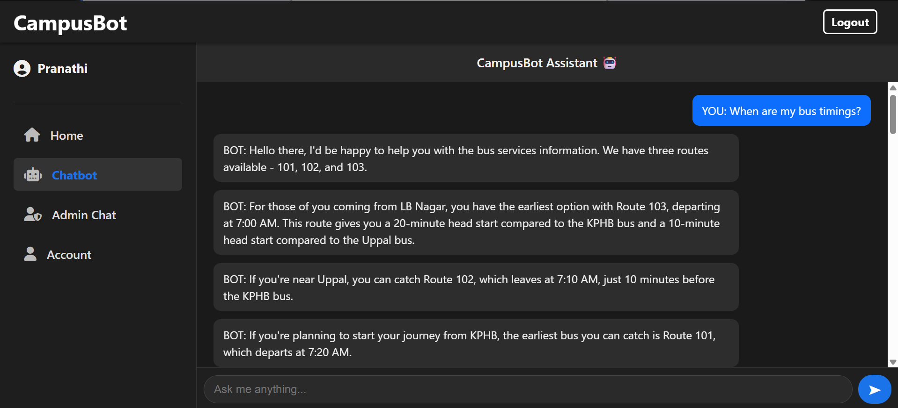
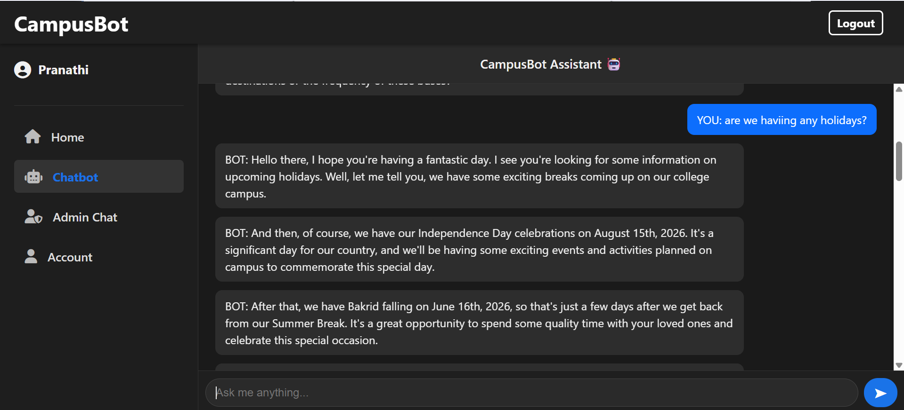
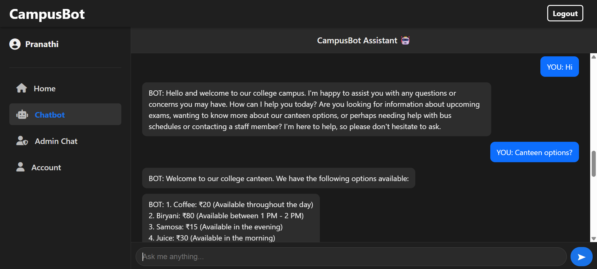
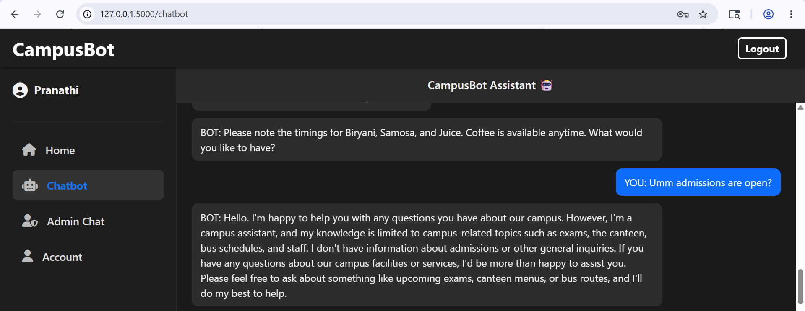
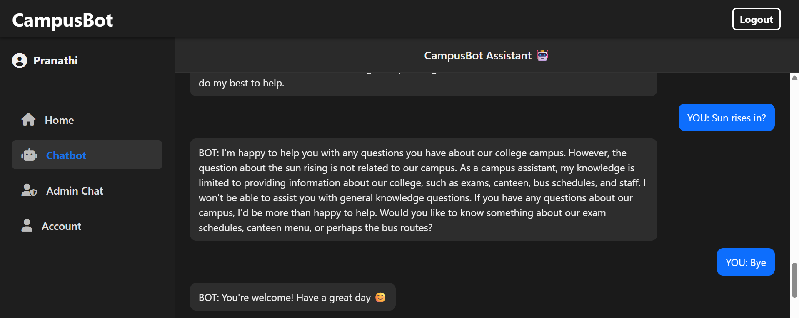

# CampusBot: AI-Driven College Assistance System

CampusBot is a comprehensive hybrid chatbot application designed to bridge the communication gap between students and college administration. It leverages **Rasa NLP** for structured queries and **Google Gemini API** for advanced generative intelligence, all tied together with a **Flask** backend and **Socket.io** for real-time communication.

---

## 🚀 Key Features

* **Hybrid AI Response System**: Uses **Rasa NLU** for college-specific tasks (fees, dates, departments) and **Google Gemini AI** for general intelligence and complex queries.
* **Real-time Admin Escalation**: Integrated **Socket.io** support allowing students to chat directly with human administrators when AI is insufficient.
* **Automated FAQ Handling**: Instant, 24/7 responses to common student queries.
* **Secure Authentication**: Role-based login system for both Students and Admins.
* **Live Dashboard**: A dedicated panel for administrators to monitor active chats, bot performance, and student records.
* **Chat Persistence**: All conversations and user data are securely managed using **SQLite3**.

---

## 🛠 Tech Stack

* **Backend**: Flask (Python)
* **NLP Engine**: Rasa Open Source
* **Generative AI**: Google Gemini API (`google-generativeai`)
* **Real-time Communication**: Socket.io with Eventlet
* **Database**: SQLite3
* **Frontend**: HTML5, CSS3, JavaScript (Vanilla)

---
This is a Hybrid RAG-based Chatbot. It combines Deterministic Retrieval with Generative Augmentation to provide accurate and context-aware responses.

Here is the breakdown of the RAG process in the project:

Retrieval (Knowledge Base): When a user asks a question, the system first attempts to retrieve specific data from the local knowledge base (Rasa's NLU training data and the SQLite Database). This ensures that college-specific information (like fee structures or dates) is 100% accurate.

Augmentation (Context Filling): If the retrieval step identifies the query as 'out-of-scope' or lacks specific data, the system augments the request by passing the context to the Google Gemini API.

Generation (LLM Output): The Gemini Pro model then generates a natural language response based on the query, ensuring the user receives a helpful answer even for complex or untrained questions.


## 💻 Installation, Setup & Execution

###  Clone & Environment Setup
First, clone the repository and set up a virtual environment to keep dependencies isolated.
```bash
# Clone the repository
git clone [https://github.com/your-username/campusbot.git](https://github.com/your-username/campusbot.git)
cd campusbot

# Create and activate virtual environment
python -m venv rasa-env
# For Windows:
.\rasa-env\Scripts\activate
# For Mac/Linux:
source rasa-env/bin/activate
Configuration & dependencies
# Install all required python packages
pip install -r requirements.txt

# Create a .env file and add your Gemini API Key
echo GEMINI_API_KEY=your_actual_key_here > .env
echo SECRET_KEY=your_flask_secret_key_here >> .env

Execution commands
rasa train
rasa run actions
rasa run --enable-api --cors "*"
python app.py


